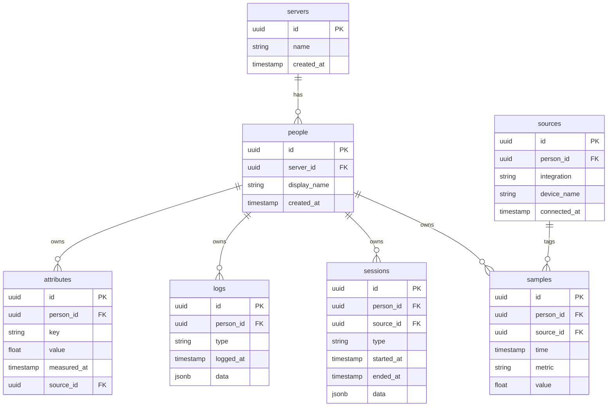

[Go back to planning home](README.md)

# Backend

> This document outlines how the backend of open-health-server works.

## Data Storage Design

### Justification
open-health-server uses TimescaleDB as its database engine. TimescaleDB is a PostgreSQL extension purpose-built for time-series data, and since the majority of OHS data is time-stamped health metrics, it is the natural fit. It provides automatic partitioning of data by time, query optimisation over large date ranges, and built-in compression for older data, all while remaining fully compatible with standard PostgreSQL tooling, drivers, and syntax. Starting with TimescaleDB from day one avoids a painful migration later as data volumes grow, and ensures the system is architected to scale to billions of rows without fundamental changes to the database layer.