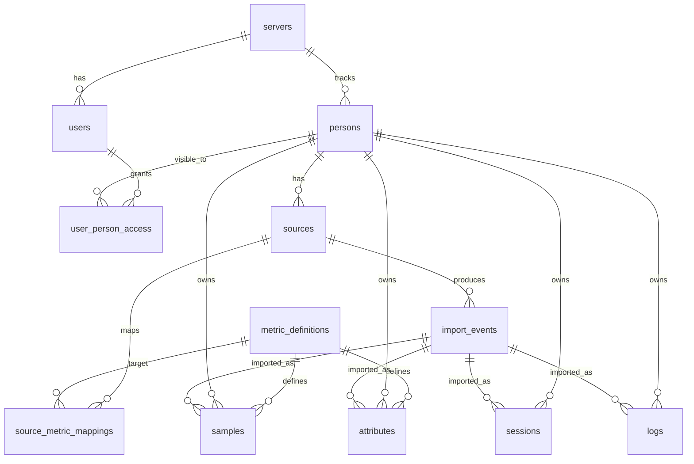

[Repo Home](../../README.md) / [Docs](../README.md) / [Planning](README.md) / Schema V1

# Schema V1

> This document describes the first implementation-oriented database shape for open-health-server.

## Purpose

The first schema should make the core ideas of open-health-server concrete without trying to model every possible health field up front.

Schema V1 should support:

- one self-hosted server instance
- multiple persons tracked by that server
- users who can access one or more persons
- canonical metric definitions
- source-specific metric mappings
- samples, sessions, logs, and attributes
- raw imported payloads for traceability
- future custom metrics and integrations

This document is still planning material. Table and column names may change once the backend stack and migration tooling are chosen.

## Design principles

- Metrics belong to persons, not directly to users.
- Users are access accounts; persons are the human identities that own data.
- Known metrics should use canonical keys from `metric_definitions`.
- External provider fields should map into canonical metrics through `source_metric_mappings`.
- Imported source payloads should be preserved where useful.
- Derived metrics should be computed from stored facts, not stored as primary facts.
- Time-series tables should be designed for TimescaleDB from the beginning.

## Entity overview



## Core tables

### `servers`

Represents the self-hosted open-health-server instance.

In most installations there will be one row, but keeping the table explicit makes ownership and future sync/federation decisions easier.

```sql
servers {
  id uuid primary key
  name text not null
  created_at timestamptz not null
  updated_at timestamptz not null
}
```

Example row:

```json
{
  "id": "8f6e6f7d-5c0a-4df4-9211-7ef03b2d6c45",
  "name": "Home Server",
  "created_at": "2026-06-11T08:30:00Z",
  "updated_at": "2026-06-11T08:30:00Z"
}
```

### `users`

Represents login accounts.

Users do not own health data directly. They receive access to one or more persons through `user_person_access`.

```sql
users {
  id uuid primary key
  server_id uuid not null references servers(id)
  email text unique
  display_name text not null
  password_hash text
  role text not null
  created_at timestamptz not null
  updated_at timestamptz not null
}
```

Example row:

```json
{
  "id": "1dfbda02-48a8-47fb-b7ad-ccf6a8f89a80",
  "server_id": "8f6e6f7d-5c0a-4df4-9211-7ef03b2d6c45",
  "email": "alex@example.com",
  "display_name": "Alex",
  "password_hash": "$argon2id$v=19$m=65536,t=3,p=4$...",
  "role": "owner",
  "created_at": "2026-06-11T08:31:00Z",
  "updated_at": "2026-06-11T08:31:00Z"
}
```

Notes:

- `email` can be nullable if local-only or passwordless auth is supported later.
- `role` is for server-level permissions, such as owner or admin.
- Person-level permissions live in `user_person_access`.

### `persons`

Represents the human identities that health data belongs to.

A person may or may not have a matching user account.

```sql
persons {
  id uuid primary key
  server_id uuid not null references servers(id)
  display_name text not null
  date_of_birth date
  sex_at_birth text
  notes text
  created_at timestamptz not null
  updated_at timestamptz not null
}
```

Example row:

```json
{
  "id": "0e9e3d32-b8d1-4e59-bb6c-483d9bdf2d72",
  "server_id": "8f6e6f7d-5c0a-4df4-9211-7ef03b2d6c45",
  "display_name": "Alex",
  "date_of_birth": "1995-04-20",
  "sex_at_birth": "female",
  "notes": "Primary person for this server.",
  "created_at": "2026-06-11T08:32:00Z",
  "updated_at": "2026-06-11T08:32:00Z"
}
```

Notes:

- `date_of_birth` and `sex_at_birth` are optional because not all deployments need them.
- Sensitive demographic fields should stay minimal until there is a clear use for them.

### `user_person_access`

Connects users to the persons they can view or manage.

```sql
user_person_access {
  id uuid primary key
  user_id uuid not null references users(id)
  person_id uuid not null references persons(id)
  access_level text not null
  can_write boolean not null
  can_manage_access boolean not null
  created_at timestamptz not null
  updated_at timestamptz not null
  unique(user_id, person_id)
}
```

Example row:

```json
{
  "id": "34206b3f-ff14-48f8-a6e2-f0d95024c7ef",
  "user_id": "1dfbda02-48a8-47fb-b7ad-ccf6a8f89a80",
  "person_id": "0e9e3d32-b8d1-4e59-bb6c-483d9bdf2d72",
  "access_level": "owner",
  "can_write": true,
  "can_manage_access": true,
  "created_at": "2026-06-11T08:33:00Z",
  "updated_at": "2026-06-11T08:33:00Z"
}
```

Suggested `access_level` values:

- `owner`
- `manager`
- `viewer`

Examples this supports:

- one user viewing one person
- one user viewing multiple persons
- multiple users viewing one person
- proxy logging for a person without a user account

## Metric catalog tables

### `metric_definitions`

Defines canonical metrics known to open-health-server.

```sql
metric_definitions {
  key text primary key
  kind text not null
  display_name text not null
  description text
  category text not null
  unit text not null
  value_type text not null
  valid_min double precision
  valid_max double precision
  enum_values jsonb
  schema jsonb
  is_custom boolean not null
  created_by_user_id uuid references users(id)
  created_at timestamptz not null
  updated_at timestamptz not null
}
```

Example row for a sample metric:

```json
{
  "key": "heart_rate",
  "kind": "sample",
  "display_name": "Heart rate",
  "description": "Instantaneous heart beats per minute.",
  "category": "cardiovascular",
  "unit": "bpm",
  "value_type": "float",
  "valid_min": 20,
  "valid_max": 240,
  "enum_values": null,
  "schema": null,
  "is_custom": false,
  "created_by_user_id": null,
  "created_at": "2026-06-11T08:34:00Z",
  "updated_at": "2026-06-11T08:34:00Z"
}
```

Example row for a structured session type:

```json
{
  "key": "running_session",
  "kind": "session",
  "display_name": "Running session",
  "description": "A running workout with start time, optional end time, and structured workout fields.",
  "category": "activity",
  "unit": "unitless",
  "value_type": "object",
  "valid_min": null,
  "valid_max": null,
  "enum_values": null,
  "schema": {
    "type": "object",
    "properties": {
      "distance_km": { "type": "number", "minimum": 0 },
      "duration_min": { "type": "number", "minimum": 0 },
      "average_heart_rate_bpm": { "type": "number", "minimum": 20, "maximum": 240 }
    },
    "required": ["distance_km", "duration_min"]
  },
  "is_custom": false,
  "created_by_user_id": null,
  "created_at": "2026-06-11T08:34:00Z",
  "updated_at": "2026-06-11T08:34:00Z"
}
```

Suggested `kind` values:

- `sample`
- `session`
- `log`
- `attribute`

Suggested `value_type` values:

- `float`
- `integer`
- `boolean`
- `string`
- `enum`
- `object`
- `array`

Notes:

- `unit` should use canonical metric units such as `bpm`, `kg`, `km`, `mmol/L`, `min`, or `unitless`.
- `schema` can describe structured session/log payloads without requiring a separate table on day one.
- Custom metrics should still be validated through this table.

### `source_metric_mappings`

Maps provider-specific field names into canonical open-health-server metric keys.

```sql
source_metric_mappings {
  id uuid primary key
  source_integration text not null
  external_name text not null
  external_unit text
  metric_key text not null references metric_definitions(key)
  canonical_unit text not null
  transform jsonb
  created_at timestamptz not null
  updated_at timestamptz not null
  unique(source_integration, external_name, external_unit)
}
```

Example row:

```json
{
  "id": "36df0ef9-5d5c-4132-a0c6-f51ec725d109",
  "source_integration": "garmin_connect",
  "external_name": "heartRate",
  "external_unit": "bpm",
  "metric_key": "heart_rate",
  "canonical_unit": "bpm",
  "transform": null,
  "created_at": "2026-06-11T08:35:00Z",
  "updated_at": "2026-06-11T08:35:00Z"
}
```

Examples:

- Garmin `heartRate` maps to `heart_rate`
- HealthKit heart rate quantity maps to `heart_rate`
- a smart scale weight field maps to `body_weight`

Notes:

- `transform` can describe simple unit conversion or extraction rules later.
- Source mapping is intentionally separate from the source instance. The mapping describes the integration, while `sources` describes a connected account or device.

## Source and import tables

### `sources`

Represents a connected device, account, integration, or manual entry source for a person.

```sql
sources {
  id uuid primary key
  person_id uuid not null references persons(id)
  integration text not null
  display_name text not null
  external_account_id text
  device_name text
  connected_at timestamptz
  disconnected_at timestamptz
  created_at timestamptz not null
  updated_at timestamptz not null
}
```

Example row:

```json
{
  "id": "dfc9ce59-50e3-4bfb-8e5e-2d874c10e5de",
  "person_id": "0e9e3d32-b8d1-4e59-bb6c-483d9bdf2d72",
  "integration": "garmin_connect",
  "display_name": "Alex's Garmin account",
  "external_account_id": "garmin-user-12345",
  "device_name": "Forerunner 965",
  "connected_at": "2026-06-11T08:36:00Z",
  "disconnected_at": null,
  "created_at": "2026-06-11T08:36:00Z",
  "updated_at": "2026-06-11T08:36:00Z"
}
```

Examples:

- Garmin Connect account
- Apple Health import
- Fitbit account
- manual entry
- n8n automation

### `import_events`

Stores raw source payloads and import metadata.

```sql
import_events {
  id uuid primary key
  source_id uuid not null references sources(id)
  person_id uuid not null references persons(id)
  external_id text
  imported_at timestamptz not null
  occurred_at timestamptz
  payload_type text not null
  raw_payload jsonb not null
  status text not null
  error_message text
  created_at timestamptz not null
  unique(source_id, external_id)
}
```

Example row:

```json
{
  "id": "c8fc7e25-dff6-4470-a6c8-8ed8bc7d50d3",
  "source_id": "dfc9ce59-50e3-4bfb-8e5e-2d874c10e5de",
  "person_id": "0e9e3d32-b8d1-4e59-bb6c-483d9bdf2d72",
  "external_id": "garmin-activity-987654321",
  "imported_at": "2026-06-11T09:15:00Z",
  "occurred_at": "2026-06-11T06:30:00Z",
  "payload_type": "activity",
  "raw_payload": {
    "activityId": "987654321",
    "activityType": "running",
    "startTimeGMT": "2026-06-11T06:30:00Z",
    "distance": 5200,
    "duration": 1710,
    "averageHR": 148
  },
  "status": "imported",
  "error_message": null,
  "created_at": "2026-06-11T09:15:00Z"
}
```

Notes:

- `external_id` may be null for sources that do not provide stable identifiers.
- `payload_type` can describe the source object, such as `activity`, `sleep`, `sample_batch`, or `daily_summary`.
- `status` can be `imported`, `partial`, `ignored`, or `failed`.
- Canonical data rows can reference the import event they came from.

## Health data tables

### `samples`

Stores timestamped measurements.

This should become a TimescaleDB hypertable partitioned by `time`.

```sql
samples {
  id uuid
  person_id uuid not null references persons(id)
  source_id uuid references sources(id)
  import_event_id uuid references import_events(id)
  metric_key text not null references metric_definitions(key)
  time timestamptz not null
  value double precision not null
  unit text not null
  quality text
  metadata jsonb
  created_at timestamptz not null
  primary key (id, time)
}
```

Example row:

```json
{
  "id": "de50e2c6-54e9-4ef4-bd9f-70500a3e0f1f",
  "person_id": "0e9e3d32-b8d1-4e59-bb6c-483d9bdf2d72",
  "source_id": "dfc9ce59-50e3-4bfb-8e5e-2d874c10e5de",
  "import_event_id": "c8fc7e25-dff6-4470-a6c8-8ed8bc7d50d3",
  "metric_key": "heart_rate",
  "time": "2026-06-11T06:45:30Z",
  "value": 152,
  "unit": "bpm",
  "quality": "device_measured",
  "metadata": {
    "sample_interval_seconds": 1
  },
  "created_at": "2026-06-11T09:15:02Z"
}
```

Notes:

- `metric_key` must refer to a `metric_definitions` row where `kind = 'sample'`.
- `unit` should normally match the canonical unit in `metric_definitions`.
- `quality` can later represent provider confidence, estimated values, or manually corrected data.
- High-volume sample data should avoid storing large raw payloads directly. Store raw payloads in `import_events`.
- The implemented migration uses `primary key (id, time)` because TimescaleDB hypertables require unique constraints to include the partitioning column.

### `sessions`

Stores activities or periods with a start and end time.

```sql
sessions {
  id uuid primary key
  person_id uuid not null references persons(id)
  source_id uuid references sources(id)
  import_event_id uuid references import_events(id)
  type_key text not null references metric_definitions(key)
  started_at timestamptz not null
  ended_at timestamptz
  timezone text
  data jsonb not null
  notes text
  created_at timestamptz not null
  updated_at timestamptz not null
}
```

Example row:

```json
{
  "id": "5fa23e1a-d3a8-4ed6-ae7a-a4c220614b70",
  "person_id": "0e9e3d32-b8d1-4e59-bb6c-483d9bdf2d72",
  "source_id": "dfc9ce59-50e3-4bfb-8e5e-2d874c10e5de",
  "import_event_id": "c8fc7e25-dff6-4470-a6c8-8ed8bc7d50d3",
  "type_key": "running_session",
  "started_at": "2026-06-11T06:30:00Z",
  "ended_at": "2026-06-11T06:58:30Z",
  "timezone": "Europe/Zurich",
  "data": {
    "distance_km": 5.2,
    "duration_min": 28.5,
    "average_heart_rate_bpm": 148,
    "max_heart_rate_bpm": 171,
    "active_calories_kcal": 410
  },
  "notes": "Easy morning run.",
  "created_at": "2026-06-11T09:15:03Z",
  "updated_at": "2026-06-11T09:15:03Z"
}
```

Notes:

- `type_key` should refer to a `metric_definitions` row where `kind = 'session'`.
- `data` holds structured fields for the session, such as distance, duration, average heart rate, or split times.
- Session field validation can start with JSON schema stored on the metric definition.

### `logs`

Stores one-time entries that do not necessarily have a duration.

```sql
logs {
  id uuid primary key
  person_id uuid not null references persons(id)
  source_id uuid references sources(id)
  import_event_id uuid references import_events(id)
  type_key text not null references metric_definitions(key)
  logged_at timestamptz not null
  timezone text
  data jsonb not null
  notes text
  created_at timestamptz not null
  updated_at timestamptz not null
}
```

Example row:

```json
{
  "id": "48d9720b-9fb5-48b8-bf16-58c3b4a6e689",
  "person_id": "0e9e3d32-b8d1-4e59-bb6c-483d9bdf2d72",
  "source_id": null,
  "import_event_id": null,
  "type_key": "mood_log",
  "logged_at": "2026-06-11T20:10:00Z",
  "timezone": "Europe/Zurich",
  "data": {
    "mood": 8,
    "stress": 3,
    "energy": 7,
    "journal": "Good training day and steady focus."
  },
  "notes": "Manual evening check-in.",
  "created_at": "2026-06-11T20:10:30Z",
  "updated_at": "2026-06-11T20:10:30Z"
}
```

Notes:

- `type_key` should refer to a `metric_definitions` row where `kind = 'log'`.
- Logs cover entries such as meals, mood, pain, medication, and illness.

### `attributes`

Stores slow-changing person facts, versioned over time.

```sql
attributes {
  id uuid primary key
  person_id uuid not null references persons(id)
  source_id uuid references sources(id)
  import_event_id uuid references import_events(id)
  metric_key text not null references metric_definitions(key)
  measured_at timestamptz not null
  value jsonb not null
  unit text not null
  notes text
  created_at timestamptz not null
}
```

Example row:

```json
{
  "id": "3bb640db-38ec-41e3-ae3c-ecb1e96b41ad",
  "person_id": "0e9e3d32-b8d1-4e59-bb6c-483d9bdf2d72",
  "source_id": null,
  "import_event_id": null,
  "metric_key": "body_weight",
  "measured_at": "2026-06-11T07:05:00Z",
  "value": {
    "amount": 64.2
  },
  "unit": "kg",
  "notes": "Measured after waking.",
  "created_at": "2026-06-11T07:06:00Z"
}
```

Notes:

- `metric_key` must refer to a `metric_definitions` row where `kind = 'attribute'`.
- `value` is JSON so attributes can support numeric, enum, string, or structured values.
- Attribute rows should be append-only for measurement history. Corrections can be handled later with superseding metadata or audit tables.

## Suggested indexes

The first migration should include indexes for the expected query paths.

```sql
-- Access checks
index user_person_access_user_id_idx on user_person_access(user_id);
index user_person_access_person_id_idx on user_person_access(person_id);

-- Sources
index sources_person_id_idx on sources(person_id);
index sources_integration_idx on sources(integration);

-- Metric lookup
index metric_definitions_kind_idx on metric_definitions(kind);
index metric_definitions_category_idx on metric_definitions(category);

-- Samples
index samples_person_metric_time_idx on samples(person_id, metric_key, time desc);
index samples_source_time_idx on samples(source_id, time desc);

-- Sessions
index sessions_person_type_started_idx on sessions(person_id, type_key, started_at desc);

-- Logs
index logs_person_type_logged_idx on logs(person_id, type_key, logged_at desc);

-- Attributes
index attributes_person_metric_measured_idx on attributes(person_id, metric_key, measured_at desc);

-- Imports
index import_events_source_imported_idx on import_events(source_id, imported_at desc);
```

## Validation rules for V1

The application layer should enforce these rules even if the database cannot express all of them directly.

- `samples.metric_key` must reference a metric with `kind = 'sample'`.
- `sessions.type_key` must reference a metric with `kind = 'session'`.
- `logs.type_key` must reference a metric with `kind = 'log'`.
- `attributes.metric_key` must reference a metric with `kind = 'attribute'`.
- Submitted units should match the canonical unit or be converted before storage.
- Numeric values should respect `valid_min` and `valid_max` when defined.
- Enum values should be checked against `enum_values`.
- Imported rows should keep `source_id` and `import_event_id` when available.
- Manual entries should use a manual source or a null `source_id`, depending on the backend convention chosen during implementation.

## Open decisions

These decisions can wait until implementation starts:

- whether to use database enums or plain text with application validation
- whether custom metrics are global to the server or scoped to a person
- whether session/log field definitions should become separate relational tables instead of JSON schema
- how much raw payload data to retain by default
- whether corrections should update rows or create explicit replacement rows
- how authentication will be implemented
- whether one physical deployment should ever support multiple `servers` rows

## Related docs

- [Implementation Timeline](implementation-timeline.md)
- [Metric Taxonomy and Schema](metric-taxonomy-and-schema.md)
- [Backend](backend.md)
- [Metrics](metrics.md)
- [Identity Management](identity-management.md)
- [Integrations](integrations.md)
